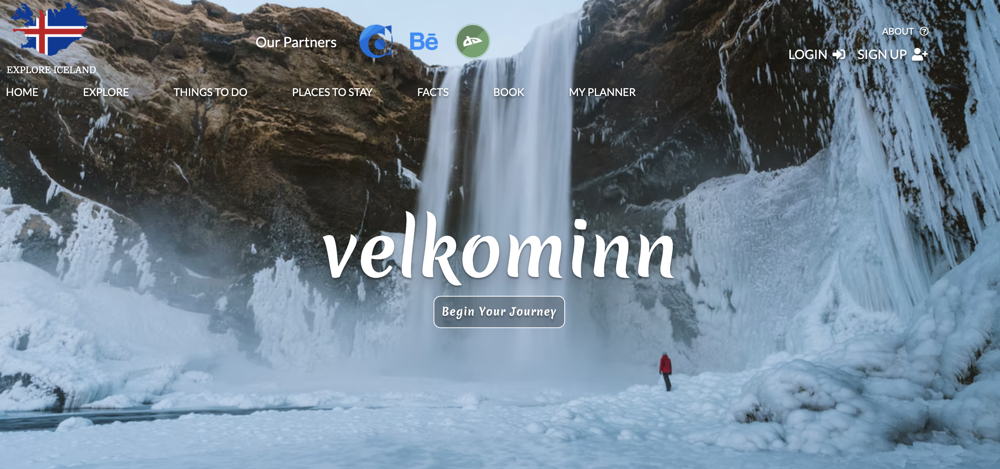
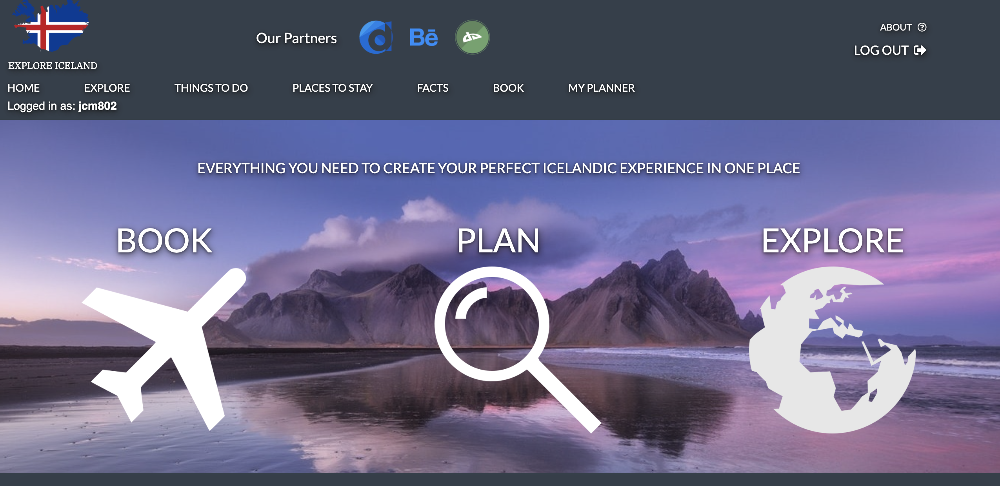
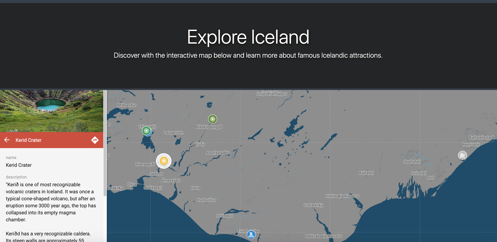
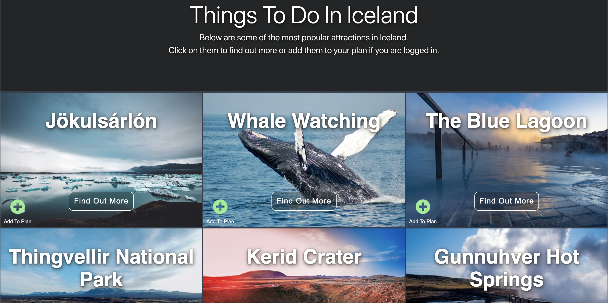
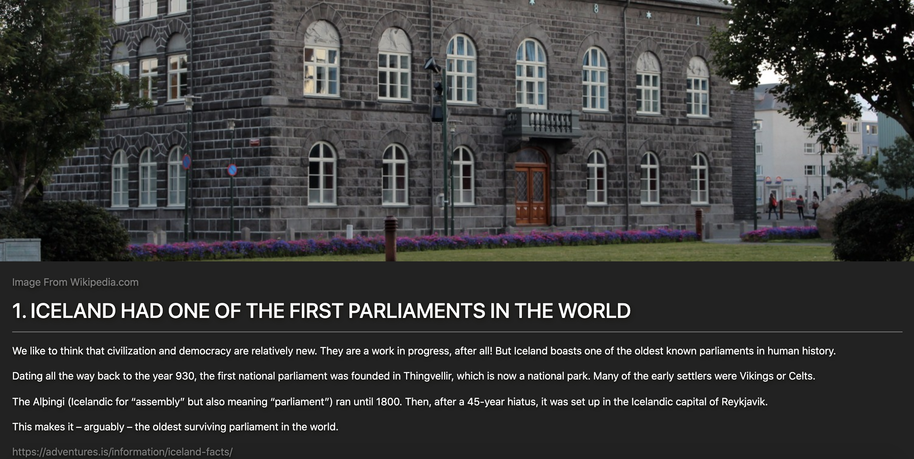
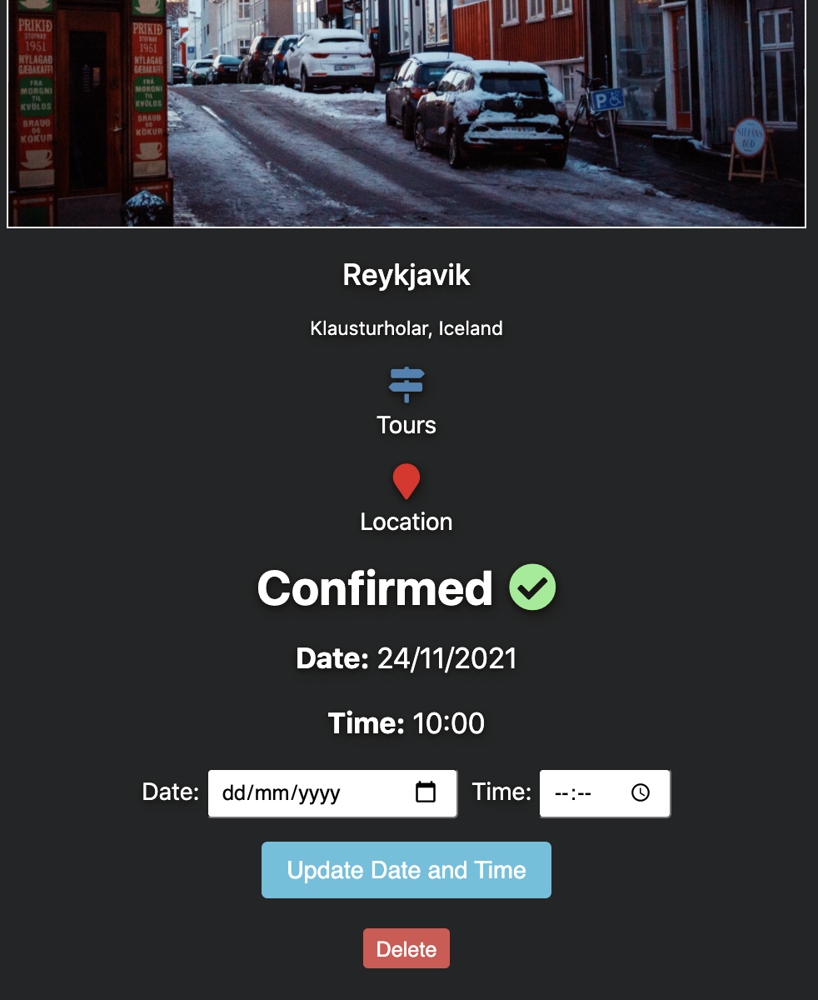
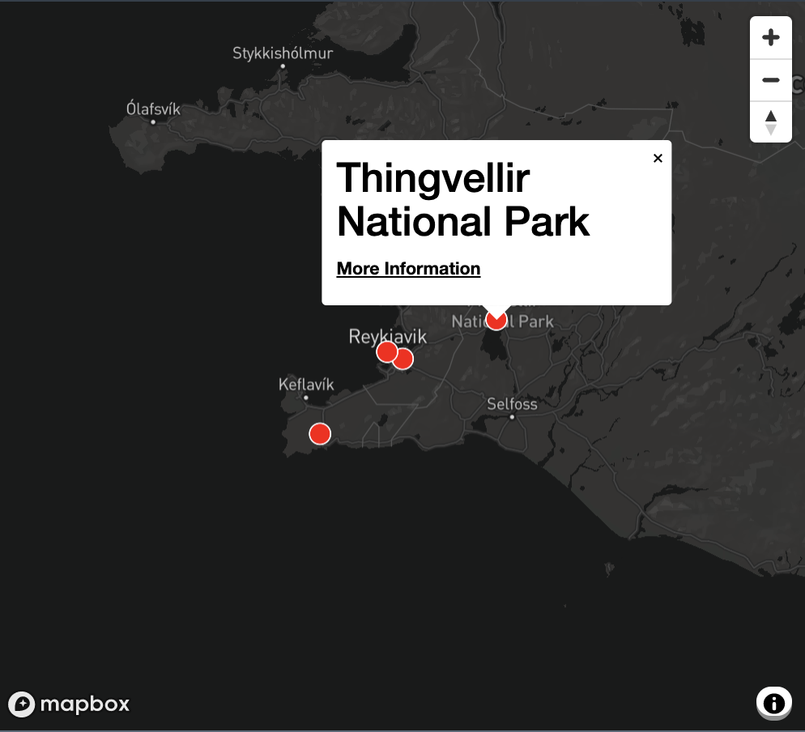

# Explore-Iceland

See the deployed site here: https://exploreiceland.herokuapp.com/

The unique feature of the website is a planner section which allows the user to add attractions from the things to do section to their account, set a time and date, and see their planned attraction plotted on a map. Added attractions are also sorted by time and date automatically.

Also includes the following: -
- Landing page with image slideshow transitions.
- Home page.
- Explore page with a google map and information about attractions with links to tours and images. 
- Things to do section with show pages for each attraction.
- Things to do show pages with a gallery, link to tours, a mapbox map showing the attraction location and reviews. Reviews show if there are any, otherwise a message saying "No reviews yet" is displayed.
- Login and sign up functionality with session management - The signed in user can add attractions to their plan, set and edit time and date and delete attractions from their plan. Attractions are sorted by time and date automatically once the user has set a time and date. They can also leave a review on the show pages. Only that user can delete their review.  
- Add, edit or delete things to do functionality on the client side reserved for myself with an admin id.
- Content security policy.
- Edge case consideration for authorisation types on client and server side.
- Cloudinary integration with show page gallery images.
- Loading screen and sliding animations for elements on scroll.
- Adherence with GDPR with cookies policy prompt to user.
- Book and facts page.
- Styling using a mix of custom CSS and isolated bootstrap (V4).

# Landing page

# Home Page

# Explore Page

# Things To Do Page

# Facts Page

# Planner Section

